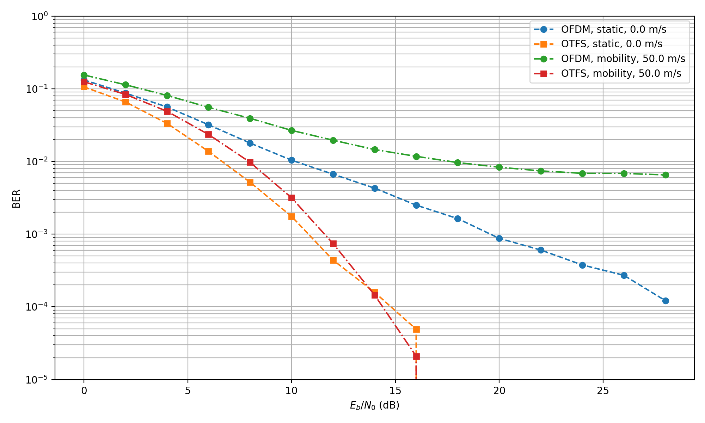

# OTFS-Transceiver-In-PyTorch
Preview results


Python experiments for OTFS modulation using PyTorch and NVIDIA Sionna. The project includes OTFS modulation/demodulation, delay-Doppler grid handling, an LMMSE equalizer, and a BER comparison against an
OFDM baseline over TDL channels.

- `otfs.py` - OTFS simulation model built from the grid, transceiver, channel,
  and equalizer blocks.
- `transceiver.py` - ISFFT-based OTFS modulator and demodulator transforms.
- `ddgrid.py` - delay-Doppler grid helper.
- `equalizer.py` - conjugate-gradient LMMSE equalizer.
- `SISOOFDMTDL.py` - OFDM baseline model.
- `comparision.py` - runs BER simulations and writes
  `comparison_ber_results.png`.
- `otfs.ipynb` - prototype and walkthrough notebooks.

Install the main Python dependencies in your environment:

```bash
pip install torch sionna matplotlib numpy
```

A CUDA-capable GPU is used automatically when available otherwise the scripts
fall back to CPU.

Run a small OTFS model smoke test:

```bash
python -m OTFS.otfs
```

Run the OFDM vs OTFS BER comparison:

```bash
python -m OTFS.comparision
```

The comparison script saves the BER plot to `comparison_ber_results.png`.

The modules use package imports such as `from OTFS.ddgrid import DDGrid`, so run
commands from the parent directory of `OTFS` or make sure that parent directory
is on `PYTHONPATH`.

References


[1] H. Li and Q. Yu, "Doubly-Iterative Sparsified MMSE Turbo Equalization for OTFS Modulation," 2024. [Online]. Available: https://arxiv.org/abs/2207.00866

[2] R. Hadani et al., "Orthogonal Time Frequency Space Modulation," arXiv:1808.00519, 2018. [Online]. Available: https://arxiv.org/abs/1808.00519

